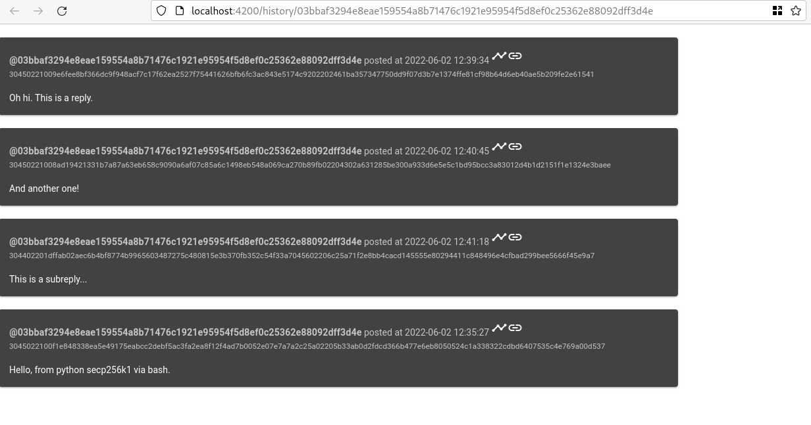

# Vixen

Vixen is an experimental open source social media platform.

It is intended to be a standardized backend server with other parties implementing the frontend interface.

There are no accounts per se but anyone can submit signed messages which then are linked to the public key.

A hashcash like proof of work puzzle to deter spam, it also prevents message relay.

There is not option to edit or delete messages. Messages are authenticated on storing on the server however the signature and public key is also public so anyone can subsequently authenticate it.

# Progress

## What's working
* Can submit messages which are authenticated by signature
* Can find last 10 messages of a user
* Can find messages that replied to a particular message
## Whats to do
* Allow people to submit signed "follower" lists to curate a page of other pubkeys they follow
* Partially working Angular front-end

# API

## Scheme

* Message - A text string of up to 256 characters
* POW - A proof of work token made up of the Unix timestamp (+/-10 leeway), a nonce, and some junk data each left padded with 0s for a fixed 10 digits separated by hyphens e.g. 0987654321-0000000000-1111111111
* Address - The secp256k1 public key
* Signature - Signature of a JSON object containing the Message and the POW as {"message": "Hello, world!", "nonce": "0987654321-0000000000-1111111111"}
* Replyto - The POW of a message that was replied to
* Timestamp - Server reciept time stamp
## /post (or /p)
### GET /post/<POW>
Returns a JSON object containing message assocaited with a particular proof of work
### POST /post/
Submit a new signed message

## GET /history/<address> (or /h/<address>)
Returns a JSON object array containing submitted posts of an address.
Will support LIMIT and OFFSET but currently limit to 10 and offset to 0

## GET /replties/<pow> (or /r/<pow>)
Returns a JSON object array containing replyto with the provided proof of work.

Will support LIMIT and OFFSET but currently limit to 10 and offset to 0
